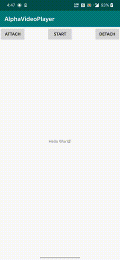
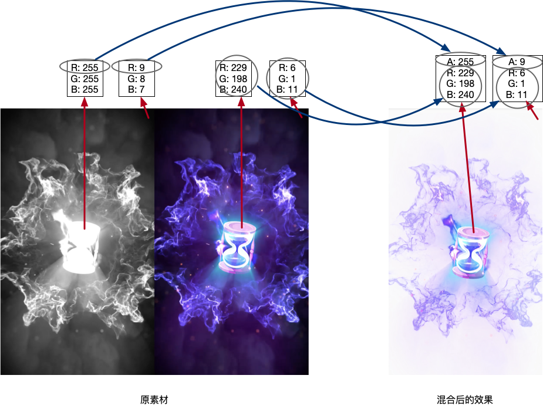
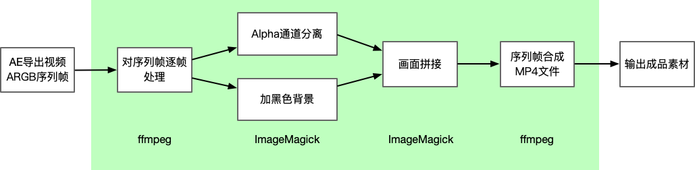

## AlphaPlayer

> Powered by ByteDance Live Android team.

AlphaPlayer是直播中台使用的一个视频动画特效SDK，可以通过制作Alpha通道分离的视频素材，再在客户端上通过OpenGL ES重新实现Alpha通道和RGB通道的混合，从而实现在端上播放带透明通道的视频。

这套方案对设计师而言明显降低了特效的制作成本，对于客户端而言有着更可靠的性能和稳定性，且相比cocos2d引擎有着更低的入门门槛和维护成本，为复杂动画的实现提供了一种全新的方式，新的复杂动画开发将会变得更加简单高效。

### 背景

在直播项目的原有礼物动画实现效果是通过cocos引擎实现的，大部分动画都是通过一系列的旋转平移缩放组合而成，能实现的动画效果较简单且开发成本较高。为了丰富动画的表现形式，降低开发成本，我们引入了AlphaPlayer的动画实现方案。

### 方案对比

目前较常见的动画实现方案有原生动画、帧动画、gif/webp、lottie/SVGA、cocos引擎，对于复杂动画特效的实现做个简单对比

| 方案        | 实现成本                             | 上手成本 | 还原程度           | 接入成本 |
| ----------- | ------------------------------------ | -------- | ------------------ | -------- |
| 原生动画    | 复杂动画实现成本高                   | 低       | 中                 | 低       |
| 帧动画      | 实现成本低，但资源消耗大             | 低       | 中                 | 低       |
| gif/webp    | 实现成本低，但资源消耗大             | 低       | 只支持8位颜色      | 低       |
| Lottie/SVGA | 实现成本低，部分复杂特效不支持       | 低       | 部分复杂特效不支持 | 低       |
| cocos2d引擎 | 实现成本高                           | 高       | 较高               | 较高     |
| AlphaPlayer | 开发无任何实现成本，一次接入永久使用 | 低       | 高                 | 低       |

**而在复杂动画特效高效实现的场景中，我们的备选方案会更少一些，可以将讨论集中在Cocos2d、Lottie、Webp和本文的AlphaPlayer上。**

#### Lottie

Lottie是非常优选的多平台动画效果解决方案，其简单原理是将AE动画导出的json文件解析成每个layer层级对象，再绘制成对应的Drawable，最后显示在View上。在不涉及mask和mattes等特性时性能非常优选，主要耗时基本集中在Canvas#draw()上而已，json解析时通过流读取的方式避免一次性加载全部json数据带来的OOM问题。

但是也存在部分不足：

1. 如果动画涉及到mask或mattes等特性时，需要生成2~3个临时bitmap实现动画效果，容易引起内存抖动，且涉及的canvas#saveLayer()和canvas#drawBitmap()会带来额外的耗时；
2. 如果动画中还直接使用了图片，在ImageAssetManager首次对图片解码是在主线程进行的（据了解在iOS的版本上，使用图片导致内存和CPU的性能消耗会更大）；
3. 主要耗时还是在draw()上，绘制区域越大耗时越长；
4. 目前支持的AE特性还有待完善，此外有一些特性在低版本上可能还会没有效果，设计资源时需要规避。（[Supported After Effect Features](http://airbnb.io/lottie/#/supported-features)）

实际使用过程中，最常见的首启全屏引导动画基本都会包含上面提到的前三点不足，这种情况下性能其实是大幅退化的。因此对于直播场景的复杂特效动画而言，Lottie就不是一个很合适的实现方案了。

#### Cocos2d-x

Cocos2d-x支持非常多的游戏功能，诸如精灵、动作、动画、粒子特效、骨骼动画等等，可以供开发者自由实现各种姿势的动画效果，再加上自身具备跨平台能力和轻量级，同时支持Lua作为开发语言，可以说是非常适合植入移动端作为动画效果实现方案的游戏引擎。

但实际使用维护中会面临很多问题：

1. 体积大，即使经过裁剪也还有2M左右的大小，如果不是核心场景需要基本很难允许接入；
2. 对开发者的技术栈有较高要求；
3. 无法满足快速迭代；
4. 维护难度大，尤其是在Android机型兼容的问题上。

#### Webp

Webp相比PNG和JPEG格式体积可以减少25%，在移动端的平台支持上也很全面，支持24位RGB色；缺点是资源体积比较大，而且使用的软解效率低下，低端机上有明显卡顿问题。

#### AlphaPlayer

相比于上面提到的几个方案，AlphaPlayer的接入体积极小（只有40KB左右），而且对动画资源的还原程度极高，资源制作时不用考虑特效是否支持的问题，对开发者和设计师都非常友好。通过接入ExoPlayer或者自研播放器可以解决系统播放器在部分机型上可能存在的兼容性问题，且能带来更好的解码性能。

### 运行效果



### 基本原理

主要有两个核心，一个是IMediaPlayer，负责视频解码，支持外部自行实现；另一个是VideoRenderer，负责将解析出来的每一帧画面进行透明度混合，再输出到GLTextureView或者GLSurfaceView上。

大致的混合过程可以看下图示例



原素材的画面中左边部分使用RGB通道存储了原透明视频的Alpha值，右边部分使用RGB通道存储了原透明视频的RGB值，然后在端上通过OpenGL重新将每个像素点的Alpha值和RGB值进行组合，重新得到ARGB视频画面，实现透明视频的动画效果。

混合过程的详细代码可以见 `frag.sh`和`vertex.sh`，

### 快速接入

##### 添加依赖

```kotlin
allprojects {
    repositories {
        ...
        maven { url 'https://jitpack.io' }
    }
}

dependencies {
    implementation 'com.github.bytedance:AlphaPlayer:1.0.4'
}
```

##### 初始化PlayerController

```kotlin
val config = Configuration(context, lifecycleOwner)
// 支持GLSurfaceView&GLTextureView, 默认使用GLSurfaceView
config.alphaVideoViewType = AlphaVideoViewType.GL_TEXTURE_VIEW
// 也可以设置自行实现的Player, demo中提供了基于ExoPlayer的实现
val playerController = PlayerController.get(config, DefaultSystemPlayer())	
playerController.setPlayerAction(object: IPlayerAction {
  override fun onVideoSizeChanged(videoWidth: Int, videoHeight: Int, scaleType: ScaleType) {
  }
  override fun startAction() {
  }
  override fun endAction() {
  }
})
playController.setMonitor(object: IMonitor {
  override fun monitor(result: Boolean, playType: String, what: Int, extra: Int, errorInfo: String) {
  }
}) 
```

##### 将PlayerController绑定到ViewGroup

```kotlin
playerController.attachAlphaView(mVideoContainer)
```

##### 播放动画视频

```kotlin
fun startVideoAnimation() {
  val baseDir = "your video file base dir"
  val portraitFileName = "portrait.mp4"
  val portraitScaleType = 2
  val landscapeFileName = "landscape.mp4"
  val landscapeScaleType = 2
  val dataSource = DataSource().setBaseDir(baseDir)
    .setPortraitPath(portraitFileName, portraitScaleType)
    .setLandscapePath(landscapeFileName, landscapeScaleType)
  	.setLooping(false)	// 可设置该视频是否循环播放
  if (dataSource.isValid()) {
    playerController.start(dataSource)
  }
}
```

##### 资源释放

```kotlin
fun releasePlayerController() {
  playerController.detachAlphaView(mVideoContainer)
  playerController.release()
}
```

### 高级特性

#### 动画对齐方式

为了解决不同屏幕尺寸的兼容问题和支持半屏动画视频的指定位置播放，我们提供了多种视频裁剪对齐方式，详细可见`ScaleType.kt`。

| 对齐模式             | 描述                                       |
| -------------------- | ------------------------------------------ |
| ScaleToFill          | 拉伸铺满全屏                               |
| ScaleAspectFitCenter | 等比例缩放对齐全屏，居中，屏幕多余部分留空 |
| ScaleAspectFill      | 等比例缩放铺满全屏，居中，裁剪视频多余部分 |
| TopFill              | 等比例缩放铺满全屏，顶部对齐               |
| BottomFill           | 等比例缩放铺满全屏，底部对齐               |
| LeftFill             | 等比例缩放铺满全屏，左边对齐               |
| RightFill            | 等比例缩放铺满全屏，右边对齐               |
| TopFit               | 等比例缩放至屏幕宽度，顶部对齐，底部留空   |
| BottomFit            | 等比例缩放至屏幕宽度，底部对齐，顶部留空   |
| LeftFit              | 等比例缩放至屏幕高度，左边对齐，右边留空   |
| RightFit             | 等比例缩放至屏幕高度，右边对齐，左边留空   |

提供多种动画对齐方式的目的有二：一是需要对不同屏幕尺寸的设备进行兼容；二是希望尽量减少屏幕中视频动画的渲染区域（这对GPU功耗有线性收益），所以如果局部渲染可以满足动画表现需求，建议尽量使用局部渲染，即减少`mVideoContainer`的布局大小。

#### Alpha通道压缩方案

为了进一步减少视频动画文件的体积，我们做了很多方向的尝试，包括透明画面像素点冗余channel的复用和整体尺寸压缩，可以期待后续更新。

### GLSurfaceView & GLTextureView

SurfaceView和TextureView都是用来显示视频画面的，主要差异在于性能和层级，SurfaceView的性能要优于TextureView，但是层级限制在最顶层，TextureView则没有层级限制。可以通过如下方式指定alphaVideoViewType来设置。

```kotlin
val config = Configuration(context, lifecycleOwner)
// 支持GLSurfaceView&GLTextureView, 默认使用GLSurfaceView
config.alphaVideoViewType = AlphaVideoViewType.GL_TEXTURE_VIEW
val playerController = PlayerController.get(config, DefaultSystemPlayer())
```

### 素材制作工具

素材制作的方式有两种：

一种是直接使用AE导出成品素材，大致流程就是后期在AE上完成动画效果后，分离出Alpha通道视频，然后在同一个AE合成里左边带Alpha通道后边带正常动画，一起渲染导出。如果还是不理解，还是让设计师去代劳吧，专业的人做专业的事。

第二种方式，在AE上完成动画后期效果后，直接输出视频序列帧，然后使用我们提供的素材制作脚本 `convertAlphaVideo.py` 进行处理也可以直接得出成品素材视频，脚本的大致原理如下：



可以看到通道分离和画面拼接是基于ffmpeg和ImageMagick两套工具实现的，所以运行前需要先配置ffmpeg和ImageMagick的环境。

执行下面命令，等待成品素材生成。

```shell
python convertAlphaVideo.py --dir 'your pictures parent file path'
```

### 已知接入方

|  |  |  |  |
| :---------------------------: | :----------------------------: | :--------------------------: | :----------------------------: |
|             抖音              |           抖音火山版           |          西瓜小视频          |            今日头条            |

### 联系我们

如果你有任何关于AlphaPlayer的问题或建议，可以发邮件到邮箱：dengzhuoyao@bytedance.com, 在邮件中详细描述你的问题。

### License

Apache 2.0

### 招聘位

再插播个招聘广告~
抖音直播团队持续招聘客户端研发，Base涵盖北京、杭州、深圳三地，简历可直接发送到邮箱：dengzhuoyao@bytedance.com，如想交流咨询可加wx：ZHp5LTMxOA==